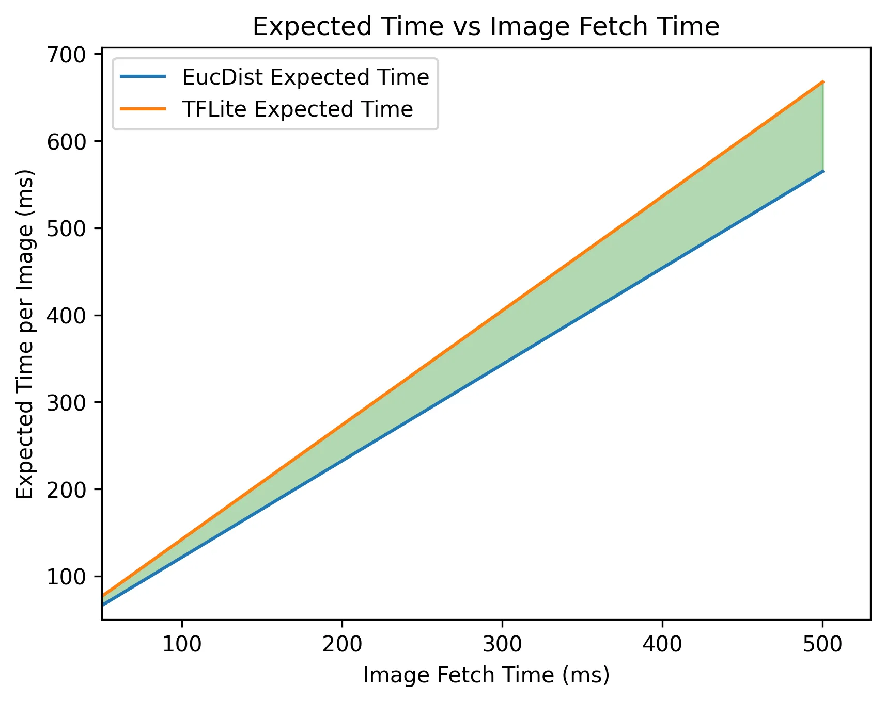

# WebAp Captcha

用來通過校務系統圖形驗證的程式。目前有三種 OCR：
- cosine similarity: 使用餘弦相似來辨識文字。
- euclidean distance：以歐式距離來辨識文字。
- tflite：以深度學習模型來辨識文字。（目前 APP 使用此方式）

## Coding Language

- Dart: 以 Dart 撰寫的版本，是實際用於 APP 的版本。將以此版本來比較不同方式的速度。
- Python: 以 Python 撰寫的版本，用於功能驗證。將以此版本來比較不同方式的準確率。

## Test Results
### Accuracy

| Method | Error/Total | Accuracy |
|--------|-------------|----------|
| TFLite | 896/5084    | 82.38%   |
| Cossim | 1365/1365   | 0%       |
| Eucdist| 51/5000     | 98.98%   |

### Speed

Platform: Windows 11, Intel i5-1145G7 @ 2.60GHz, 16GB RAM  
tested on 16329 samples

| Method | Inference Time (ms) |
|--------|---------------------|
| TfLite | 39917 ms            |
| EucDist| 47775 ms            |

Platform: Android 15, MediaTek Dimensity 1080 @ 2.60GHz, 8GB RAM  
tested on 2001 samples

| Method | Inference Time (ms) |
|--------|---------------------|
| TfLite | 7616 ms             |
| EucDist| 8863 ms             |

## Conclusion

### Expected time

為了更公平的比較不同方法的效能，使用以下公式來計算預期時間：

```
預期時間(E) = (抓取圖片時間(x) +  推理時間(t)) / 模型準確度(p)
```

圖表依據以下數據繪製：
- Euclidean Distance 推理用時比 TFLite 多約 1.18 倍。
- TFLite 的準確度為 82.38%，Euclidean Distance 的準確度為 98.98%。



雖然 Euclidean Distance 的推理時間較長，但因為其準確度較高，導致其預期時間反而較短。當網路狀況不佳時，這種差異會更加明顯。目前的 TFLite 模型準確度過低，導致無論網路狀況如何，其預期時間都較長。

若要使用 TFLite 模型，則至少需要將模型的準確度提升至 93% 以上，且在幾乎不損失推理速度的情況下，預期時間才能與 Euclidean Distance 相當。

## Improvement

$$I=(1-\frac{\text{E}2}{\text{E}1})\times{100\%}$$

當 $x$ 趨近無限大時，會趨近於 16.8。

$$\lim_{x \to \infty}1-\frac{(1+\frac{1.18t_1}{x})p_1}{(1+\frac{t_1}{x})p_2}=1-\frac{p1}{p2}$$


